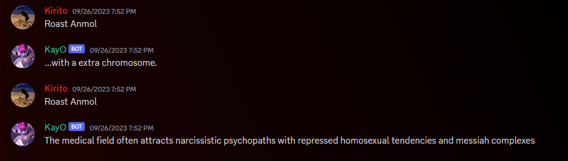

# Simple Discord Bot

## Description
This is a simple Discord bot that responds to specific messages in your Discord server/channel.

## Preview
**1**

## Features
- Replies to specific messages with predefined responses.
- Easy to deploy and use on platforms like repl.it.
- Requires a Discord bot token and channel ID for setup.

## How to Use
1. **Open repl.it or clone the repository**
2. **Change responses in code as per you need**
3. **Add token and channel id**
4. **Allow user requirment from Discord Developer Portal**
5. **Create your own bot**
6. **Run this code with your bot token**
7. **Have Fun**

## Contributors
- [Shreyansh Rajput]

## License
This project is licensed under the MIT License. See the [LICENSE](LICENSE) file for details.
